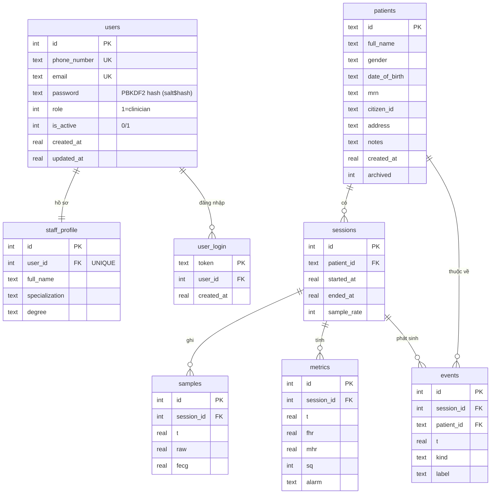

# Sơ đồ ERD — fECG Server

Sơ đồ quan hệ thực thể (Entity Relationship Diagram) của cơ sở dữ liệu SQLite trong `database.py`.

## Mô hình tổng quát

Chỉ **nhân viên y tế** mới là tài khoản đăng nhập: mỗi nhân viên là 1 dòng trong `users`
(thông tin xác thực) + 1 dòng `staff_profile` (thông tin nghiệp vụ). **Bệnh nhân** là *đối tượng
theo dõi*, không đăng nhập, nên giữ bảng riêng `patients` với khóa chính là chuỗi tự nhiên (vd "P001").

## 8 thực thể (bảng)

| Bảng | Khóa chính | Vai trò |
|------|-----------|---------|
| `users` | `id` | Tài khoản đăng nhập (auth): phone/email/password/role/is_active |
| `staff_profile` | `id` | Hồ sơ nhân viên (họ tên, chuyên khoa, học vị) — 1-1 với `users` |
| `user_login` | `token` | Phiên đăng nhập web (cookie token) |
| `patients` | `id` (TEXT) | Hồ sơ bệnh nhân (thai phụ) — không có tài khoản |
| `sessions` | `id` | Mỗi lần đo / kết nối thiết bị |
| `samples` | `id` | Waveform thô + fECG (đã downsample) |
| `metrics` | `id` | Trend FHR/MHR/SQ/alarm (~1 Hz) |
| `events` | `id` | Báo động / mốc phiên / ghi chú |

## Quan hệ & lực lượng (cardinality)

- `users` **1 — 1** `staff_profile` (mỗi tài khoản nhân viên có đúng một hồ sơ)
- `users` **1 — N** `user_login` (một tài khoản có nhiều token đăng nhập)
- `patients` **1 — N** `sessions` (một bệnh nhân có nhiều phiên đo)
- `sessions` **1 — N** `samples`
- `sessions` **1 — N** `metrics`
- `sessions` **1 — N** `events`
- `patients` **1 — N** `events` (events lưu **cả** `patient_id` lẫn `session_id`)

## Sơ đồ ERD (Mermaid)

## Ghi chú quan trọng

1. **Không có FOREIGN KEY thật trong DB.** Các quan hệ trên là *logic* (cột `*_id` trỏ tới bảng cha),
   nhưng schema không khai báo `FOREIGN KEY ... REFERENCES`. Khi nộp báo cáo nên ghi
   "ràng buộc khóa ngoại ở mức ứng dụng" để chính xác.

2. **Đăng nhập bằng phone HOẶC email.** `users.phone_number` và `users.email` đều UNIQUE;
   `get_user_by_login(identifier)` so khớp với một trong hai, và chỉ chấp nhận `is_active=1`.

3. **`role` để dành cho RBAC sau.** Hiện mọi tài khoản active có quyền như nhau (chưa gate
   endpoint theo role); cột `role` chỉ phân loại sẵn (mặc định 1 = clinician).

4. **Bệnh nhân dùng khóa tự nhiên TEXT.** `patients.id` (vd "P001") là khóa load-bearing:
   xuất hiện trong URL `/patient/{id}`, WebSocket `/ws/live/{id}`, key pub/sub, tên file CSV,
   và `sessions.patient_id`. Không đổi sang surrogate int.
